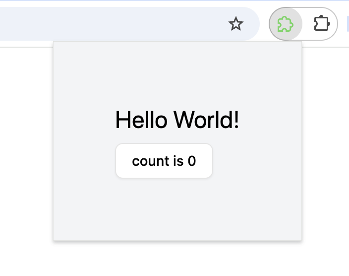

# WXT Tailwind Shadcn-Vue Starter



A WXT starter template preconfigured with Vue 3, Tailwind CSS, and Shadcn-Vue.

## Setup

### Install dependencies

```bash
pnpm install
```

### Start development (Chrome)

```bash
pnpm dev
```

### Start development (Firefox)

```bash
pnpm dev:firefox
```

WXT will open a browser window automatically with the extension loaded.

## Build for Production

### Chrome

```bash
pnpm build
```

### Firefox

```bash
pnpm build:firefox
```

Output is in `.output/`.

## Load Unpacked (manual)

If you want to load the extension manually:

**Chrome**

1. Go to `chrome://extensions`
2. Enable **Developer mode**
3. Click **Load unpacked** → select `.output/chrome-mv3`

**Firefox**

1. Go to `about:debugging#/runtime/this-firefox`
2. Click **Load Temporary Add-on** → select any file inside `.output/firefox-mv2`

## Other Scripts

```bash
pnpm compile   # Type-check without emitting
pnpm format    # Format code with Prettier
```

## Stack

- [WXT](https://wxt.dev) — browser extension framework
- [Vue 3](https://vuejs.org) — UI framework
- [Tailwind CSS v4](https://tailwindcss.com) — utility-first CSS
- [Shadcn-vue](https://www.shadcn-vue.com) — accessible UI components
- [Sass](https://sass-lang.com) — CSS preprocessor support
